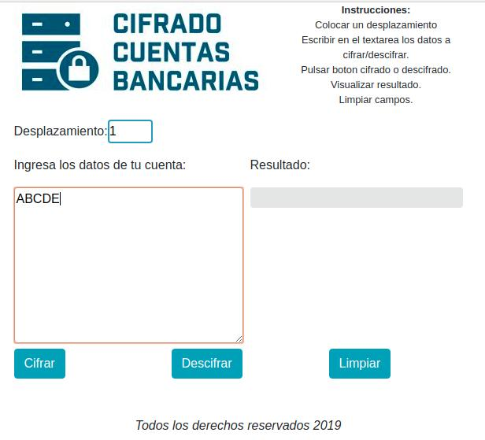
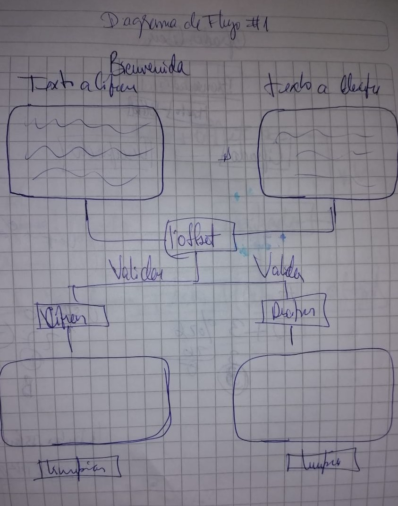
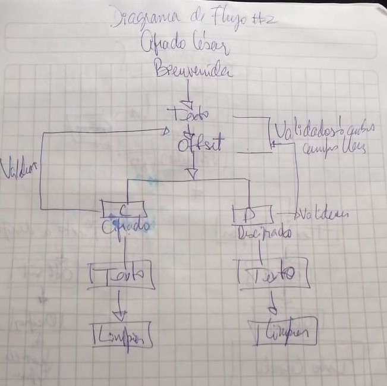
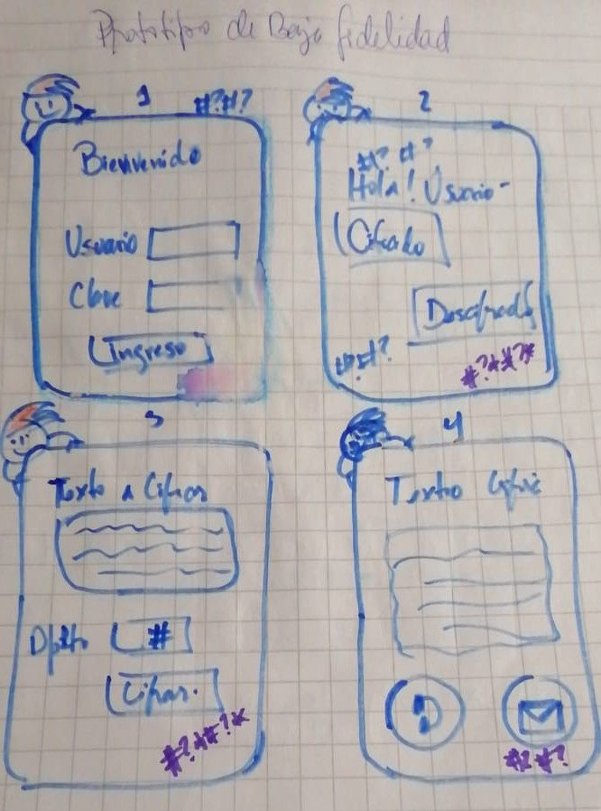
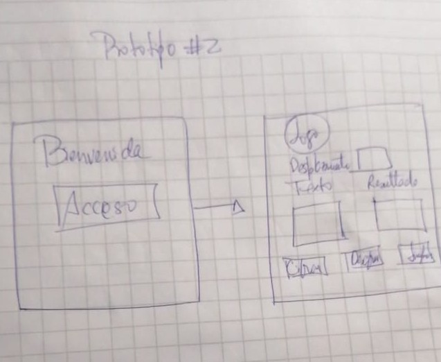

# Cifrado César para Cuentas Bancarias (CCB)

Cifrar o encriptar información, se utiliza desde tiempos antiguos para la protección de los datos. El objetivo de esta aplicación principalmente es permitirle al usuario cifrar su información bancaria, mediante el método del Cifrado Cesar, el cual consiste en reemplazar cada letra o numero del texto ingresado en un numero de posiciones indicadas.

 

La idea surge por la necesidad que existe para los venezolanos de no poder acceder estando en el exterior a sus cuentas bancarias, ya que la cuenta se bloquea cuando se determina que hubo un intento de ingreso a la entidad bancaria desde país distinto, por lo que se requiere de un tercero que se encuentre en Venezuela que posea la información para realizar las transacciones necesarias.

Tomando en cuenta que surgen eventualidades en las que se extravía un dispositivo móvil, o se deja una sesión iniciada de alguna cuenta correo electrónica, red social, etc. la información del usuario se compromete a ser hurtada, por lo que el objetivo principal de la aplicación es que pueda brindar la mayor seguridad posible ante este tipo de situaciones.

La aplicación de cifrado para cuentas bancarias, permite al usuario encriptar la información para ser compartida a través de las diferentes medios de envío y recepción de mensajes con aquella persona de confianza, a la cual pueda enviarle su datos cifrados, y la contraparte de manera segura pueda realizar el descifrado sin comprometer la información, utilizando una interfaz simple y amigable.

## Diseño y Construcción

Para la construcción de la aplicación se utilizo HTML5, CSS3, vanilla JS, Node.js, Mocha, Bootstrap 4.

Se realizaron distintos diagramas de control de flujo para plantear las distintas acciones que el usuario debe accionar para llegar al resultado, del mismo modo se realizaron en papel las posibles pantallas que se considerarían en el producto final, considerando que estas son posibles alternativas pero no las definitivas.

## Diagrama de Flujo

A continuación se muestran los diagramas de flujo que se plantearon para la construcción del cifrado.

Diagrama de Flujo #1

En el primer diagrama se considero utilizar dos textareas, teniendo en común el numero de desplazamientos, y mostrando el resultado en dos texareas independientes.

Diagrama de Flujo #2

Luego de recibir feedback, se establece un nuevo diseño, donde se realiza el ingreso del texto, con el desplazamiento, y de allí elegir entre el cifrado y descifrado, considerando validar que hayan datos en los campos te texto, para así obtener el resultado esperado, y anexando un botón de limpiar para reiniciar el proceso. 

## Prototipo de baja fidelidad

Primeramente se plantea el siguiente prototipo:

Prototipo #1

Luego de recibir feedback y de considerar las mismas, se establece un segundo prototipo:

Prototipo #2

A partir de este prototipo se define el diseño de la aplicación, se crea el logo, colores  y se establece la posición de los distintos campos, botones y textos. Se construye el código y se establecen las distintas tareas a cumplir para llevar a cabo las actividades anteriormente mencionadas, utilizando para ello  la herramienta Trello como gestor de las actividades que requerían ser planificadas y priorizar la mas relevantes para alcanzar el objetivo principal y los requerimientos mas importantes.

## Encuesta

Luego de construir la aplicación se procedió a realizar  encuestas para evaluar la interacción del usuario con la misma. Se selecciono una población de cinco personas de origen venezolano que son poseedoras de cuentas bancarias en esa región. La encuesta se realizo a través de whatsapp, ya que por falta de tiempo no se pudo hacer presencial.

EL dialogo establecido fue el siguiente: 

Hola, me encuentro realizando un estudio para determinar el funcionamiento de una aplicación que brinde seguridad en los datos de las cuentas bancarias, específicamente para personas venezolanas que se encuentran en el extranjero y no pueden realizar transacciones desde el exterior. A continuación tomare unos 5 minutos de su tiempo para responder las siguientes preguntas:

1. El termino cifrado es para Ud. comprensible?
2. Alguna vez se ha visto en la necesidad de cifrar alguna información?
3. Requiere Ud. de algún tercero en Venezuela para realizar sus transacciones bancarias?
4. Considera seguro el envío de sus datos a través de redes sociales o correo electrónico?
5. Si existiera un modo de enviar sus datos de forma mas segura, optaría por el?
6. A continuación el siguiente enlace lo redirige a una aplicación, para cifrar datos y al mismo tiempo descifrarlo, por favor pude hacer uso de ella y dar una opinión acerca de la misma? https://nohestmm.github.io/SCL009-Cipher/src/index.html

## A quien esta dirigida la aplicación
* A todos aquellos usuarios que deseen encriptar sus datos bancarios.

## Demostración

En el siguiente vinculo puedes acceder y experimentar el funcionamiento de la aplicación: [Enlace
](https://nohestmm.github.io/SCL009-Cipher/src/index.html)

### Pasos a seguir 
* Dar click en el boton de acceso.
* Colocar un desplazamiento para lograr cifrar o descifrar.
* Escribir en el textarea los datos que se quieren encriptar.
* Pulsar el boton de cifrado o descifrado.
* Visualizar el resultado.
* Limpiar los campos para volver a cifrar o descifrar.

